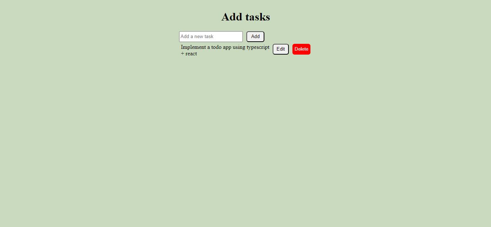

# todo-app-react

A simple todo app implemented using react with typescript

## Follow these steps to install

- Clone this repo
  `git clone https://github.com/biniyamNegasa/todo-app-react.git`
- Go into the folder
  `cd todo-app-react`
- Run
  `npm install && npm run dev`

## Here's a sample

